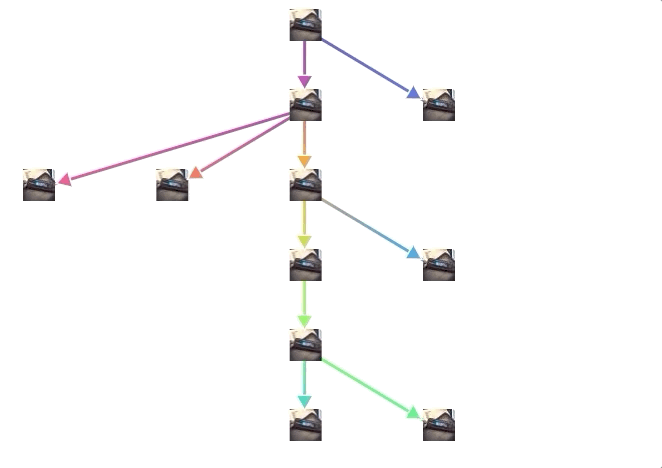

# skilltree.js

[Demo](https://alincode.github.io/skilltree.js/)

### feature

* [x] icon image node & if icon empty use default
* [x] click event open window
* [x] workshop json load data
* [x] workshop have different url
* [x] hover event show title



### run demo

```
npm install
npm start
```

### customized css

* you can add some css to make your own style.

### standard data structure

* `parentIds`
  * if it is a root node, should don't have `parentIds` property.
  * `parentIds` is a array.
* `title` will show in the tooltip.

### javascript example

```js
const skilltree = require('skilltree.js')
const faker = require('faker')
const html = require('nanohtml')

const dag_data = [
  {
    id: '0',
    title: 'Solidity',
    url: 'https://play.ethereum.org/play-workshop/',
  },
  {
    id: '1',
    parentIds: ['0'],
    title: 'Variables',
    url: 'https://play.ethereum.org/play-workshop/',
  },
  {
    id: '2',
    parentIds: ['0'],
    title: 'Events',
    url: 'https://play.ethereum.org/play-workshop/',
  },
  {
    id: '3',
    parentIds: ['2'],
    title: 'Mappings',
    url: 'https://play.ethereum.org/play-workshop/',
  },
  {
    id: '4',
    parentIds: ['2'],
    title: 'Types',
    url: 'https://play.ethereum.org/play-workshop/',
  },
  {
    id: '5',
    parentIds: ['2'],
    title: 'Modifiers',
    url: 'https://play.ethereum.org/play-workshop/',
    icon: faker.image.imageUrl(32, 32),
  },
  {
    id: '6',
    parentIds: ['9'],
    title: 'Imports',
    url: 'https://play.ethereum.org/play-workshop/',
    icon: faker.image.imageUrl(32, 32),
  },
  {
    id: '7',
    parentIds: ['3'],
    title: 'Source File',
    url: 'https://play.ethereum.org/play-workshop/',
  },
  {
    id: '8',
    parentIds: ['3'],
    title: 'Remix',
    url: 'https://play.ethereum.org/play-workshop/',
  },
  {
    id: '9',
    parentIds: ['8'],
    title: 'Deploying',
    url: 'https://play.ethereum.org/play-workshop/',
    // icon: faker.image.imageUrl(32, 32),
  },
  {
    id: '10',
    parentIds: ['9'],
    title: 'Networks',
    url: 'https://play.ethereum.org/play-workshop/',
  },
]

const element = html`
  <div class="app">
    ${skilltree(dag_data)}
  </div>
`

// const element = html`
//   <div class="app">
//     ${skilltree(dag_data, '4')}
//   </div>
// `

document.body.appendChild(element)
```

## License
MIT © [alincode](https://github.com/alincode/solcjs-lightweight)